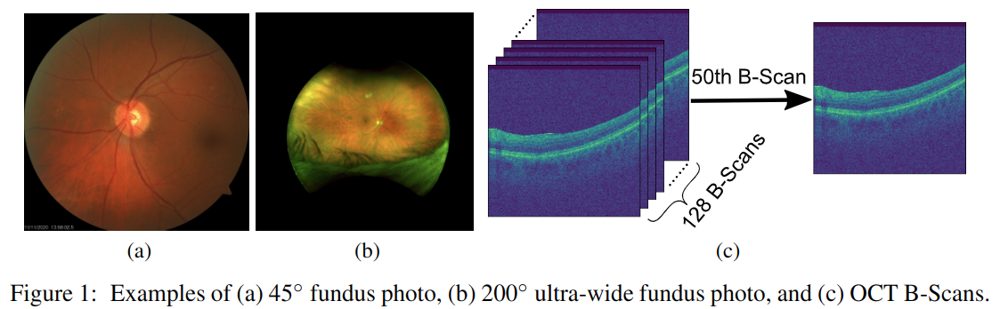
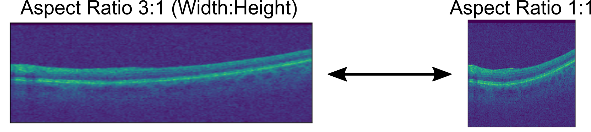

# Harvard-DR: A 3D Imaging Dataset of Diabetic Retinopathy for Fairness Learning
Currently, there is no large state-of-the-art 3D imaging dataset for medical fairness study with deep learning that is publicly available. Therefore, we introduce our Harvard Diabetic Retinopathy (Harvard-DR) dataset to address the above limitation. The experiments are conducted on a Ubuntu 22.04.2 LTS machine, equipped with an Nvidia RTX A6000 graphics card.

<p align="center">

</p>


## Download Dataset

Harvard-DR is hosted on Harvard Dataverse and can be accessed at [Harvard-DR](https://doi.org/10.7910/DVN/NCAB6P).

For convenience, we can download the dataset by the provided script, i.e., 

```shell
./download_dataset.sh
```

The dataset consists of 3300 samples, each patient has one sample. It includes 2100 samples for training, 300 for validation, and 900 for testing. Each sample stored in a npz file has its own fundus image, diabetic retinopathy (DR) label, OCT B-Scans, patient age, race, gender, and ethnicity.

Each npz file contains the following attributes:
1) fundus: the fundus image.
2) oct_bscans: 3D OCT B-scans image of size 200x200x128.
3) dr_class: DR label, i.e., 0: Normal, 1: NPDR, or 2: PDR.
4) age: patient age.
5) race: patient race, 0 for Asian, 1 for Black or African American, and 2 for White or Caucasian.
6) male: patient sex, 0 for female and 1 for male.
7) ethnicity: 0: Non-Hispanic, 1: Hispanic

## Train and Evaluate Models

We provide scripts to train and evaluate the 2D, 3D, and fairness models 

For training 2D models please run
```shell
./scripts/train_dr_fair.sh
```

For training 3D models please run
```shell
./scripts/train_dr_fair_3d.sh
```


For training 2D fair adversarial loss please run
```shell
./scripts/train_dr_fair_2d_adv.sh
```

For training 3D fair adversarial loss please run
```shell
./scripts/train_dr_fair_3d_adv.sh
```

For training FSCL please run
```shell
./scripts/train_dr_fair_contrastive_pretrain.sh 
./scripts/train_dr_fair_contrastive_finetune.sh
```

Please ensure that you modify the data path to properly guide the process of accessing the data.

## Aspect Ratio of OCT B-Scans

<p align="center">

</p>

In clinical practice, OCT devices commonly provide axial resolutions in the range of a few micrometers ($\mu m$). The axial resolution refers to the ability to distinguish between closely spaced structures along the depth axis of the scan. As shown in the figure, the aspect ratio of the original OCT B-Scans is 3. Following the common practice, we resize each OCT B-Scan to an aspect ratio of 1. In particular, the resolution is 200 $\times$ 200. 

To transfer back to the original aspect ratio, we can execute the following commands.
```python
import numpy as np
import os 
import cv2

npz_data = np.load(one_npz_file, allow_pickle=True)
oct_img = npz_data['oct_bscans']
new_bscan = cv2.resize(oct_img[0,:,:], (600, 200))
```
